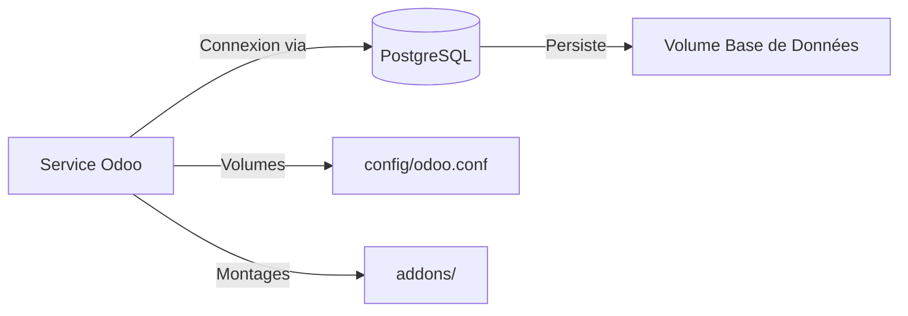

# Documentation Complète du Projet Odoo 18 Docker

## Aperçu du Projet
Ce projet implémente un module Odoo 18 personnalisé pour la gestion du marché, comprenant :
- Gestion des entreprises avec règles de validation
- Suivi des activités du marché avec contrôles de budget/date
- Déploiement Dockerisé avec PostgreSQL
- Vues UI personnalisées et règles de sécurité

---

## Structure des Fichiers & Descriptions

### 1. Fichiers Principaux du Module
| Fichier/Dossier         | Objectif                                                              |
|-------------------------|-----------------------------------------------------------------------|
| `__init__.py`          | Initialise le package/module Python                                  |
| `__manifest__.py`      | Métadonnées du module (nom, dépendances, fichiers de données)        |
| `entreprise_marche.py` | Définit le modèle `market.company` avec validation de téléphone/date |
| `activite_marche.py`   | Définit le modèle `market.activity` avec contraintes budget/date     |
| `ir.model.access.csv`  | Règles de sécurité pour l'accès aux modèles                         |

### 2. Composants UI
| Fichier                 | Composants                                                            |
|-------------------------|-----------------------------------------------------------------------|
| `entreprise_views.xml`  | - Vues Liste/Formulaire pour les entreprises<br>- Champs : Secteur, Téléphone, Pays |
| `activite_views.xml`    | - Vues Liste/Formulaire pour les activités<br>- Champs : Budget, Statut, Localisation |
| `actions.xml`           | Actions de fenêtre pour la navigation dans les menus                |
| `menus.xml`             | Structure des menus principaux avec éléments parent/enfant          |

### 3. Infrastructure Docker
| Fichier/Dossier         | Objectif                                                              |
|-------------------------|-----------------------------------------------------------------------|
| `docker-compose.yaml`   | Orchestration des services Odoo+PostgreSQL                           |
| `config/odoo.conf`      | Configuration Odoo (chemin des addons)                              |
| `odoo_pg_pass`         | Secret du mot de passe PostgreSQL                                  |
| `addons/`              | Volume hôte pour les modules personnalisés                          |

---

## Détails Techniques d'Implémentation

### 1. Modèle d'Entreprise du Marché (`market.company`)
```python
# Fonctionnalités clés :
- Validation du téléphone via regex
- Date d'enregistrement ne peut être future
- Relations : Many2one vers res.country
- Champs : Site web, Adresse (textarea), Secteur d'activité
```

### 2. Modèle d'Activité du Marché (`market.activity`)
```python
# Fonctionnalités clés :
- Contrainte SQL : end_date ≥ start_date
- Contraintes Python : budget ≥ 0
- Sélection du statut : Brouillon/Actif/Terminé
- Zones de texte pour objectifs/notes
```

### 3. Implémentation de la Sécurité
```csv
# Règles d'accès :
- Permissions CRUD complètes pour base.group_user
- Couvre `market.company` et `market.activity`
```

### 4. Fonctionnalités UI/UX
```xml
<!-- Vues Liste -->
- Capacités de filtrage/tri intelligentes
- Champs clés visibles en un coup d'œil

<!-- Vues Formulaire -->
- Regroupement logique des champs associés
- Widgets texte pour saisies multi-lignes
- Sélecteurs de dates pour les champs date
```

---

## Guide de Déploiement Docker

### 1. Architecture de l'Infrastructure


### 2. Configuration de l'Environnement
```yaml
# Paramètres clés de docker-compose.yaml :
services:
  web:
    image: odoo:18.0  # Version explicite
    environment:
      - HOST=db
      - USER=odoo
      - PASSWORD_FILE=/run/secrets/postgresql_password

  db:
    image: postgres:15  # Version compatible vérifiée
    environment:
      - POSTGRES_USER=odoo
      - POSTGRES_PASSWORD_FILE=/run/secrets/postgresql_password
```

### 3. Stockage Persistant
```bash
# Volumes :
- odoo-web-data : Données de session/filestore
- odoo-db-data : Fichiers de base de données PostgreSQL
- ./addons : Répertoire de développement de modules en direct
```

---

## Commandes Opérationnelles

### 1. Gestion du Cycle de Vie
```bash
# Démarrer les conteneurs en arrière-plan
docker compose up -d

# Arrêter et supprimer les conteneurs+volumes
docker compose down -v

# Afficher les logs en temps réel
docker compose logs -f web
```

### 2. Développement de Module
```bash
# Workflow de rechargement à chaud :
1. Modifier les fichiers dans ./addons/market_management
2. Odoo recharge automatiquement les modifications sous 60s
3. Mettre à jour la liste des applications dans l'interface Odoo
```

### 3. Gestion de la Base de Données
```bash
# Créer une sauvegarde
docker exec -t odoo-web-1 pg_dump -U odoo > backup.sql

# Restaurer une sauvegarde
cat backup.sql | docker exec -i odoo-db-1 psql -U odoo
```

---

## Meilleures Pratiques de Sécurité

1. **Gestion des Mots de Passe**
   - Stocker `odoo_pg_pass` en dehors du contrôle de version
   - Utiliser `chmod 600` pour les permissions de fichiers
   - Changer régulièrement les mots de passe

2. **Sécurité Réseau**
   - Exposer uniquement les ports nécessaires (8069/8072)
   - Envisager un proxy inverse avec terminaison SSL

3. **Stratégie de Mise à Jour**
   - Reconstruire les conteneurs mensuellement avec les correctifs de sécurité
   - Tester les mises à niveau de version dans un environnement de test

---

## Guide de Dépannage

| Problème                      | Étapes de Résolution                              |
|--------------------------------|--------------------------------------------------|
| Module non visible dans Apps   | 1. Vérifier `addons_path` dans odoo.conf<br>2. Vérifier les permissions des dossiers |
| Erreurs de connexion BDD       | 1. Vérifier le fichier de mot de passe<br>2. Consulter les logs du conteneur DB |
| Erreurs de validation dans UI  | 1. Vérifier les contraintes Python<br>2. Consulter la console du navigateur |
| Performance lente              | 1. Ajouter de la RAM à Docker<br>2. Activer `pg_stat_statements` |

